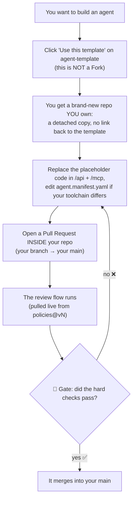

# agent-template — the starter kit

> **Part of 图灵星球 Agent 军团.** New here? Start at the overview: **https://github.com/turingplanet/agent-legion**

This is the **starter kit** you copy to begin a new agent. It's a **runnable python-mcp skeleton**: copy it, open a PR, and the review flow passes on the placeholder stubs — then you replace them with your own logic. You copy it **once** ("Use this template"); after that your repo is independent.

## What's inside

- **`/api`** — your business logic (currently a placeholder `run()` — the only place you write real code).
- **`/mcp`** — a thin MCP wrapper that exposes `/api`.
- **`tests/`** — a smoke test (replace with real tests for your agent).
- **`agent.manifest.yaml`** — the instruction card, pre-filled with python + poetry defaults. Edit it if your toolchain differs.
- **`manifest.schema.json`** — the contract your manifest must satisfy.
- **`.github/workflows/review.yml`** — the thin pointer that references [`policies@v4`](https://github.com/turingplanet/policies).

## How to start your own agent

1. Click **"Use this template" → Create a new repository**. This is a detached copy you own — **not a Fork**.
2. In your new repo, **replace the placeholder code** in `/api` + `/mcp` with your logic, and edit `agent.manifest.yaml` if your toolchain differs.
3. Open a pull request **inside your repo** (a branch → your `main`). That runs the review flow from `policies@vN`, and the gate decides whether it merges.

You never fork this repo or `policies`. You copy this kit **once**, and your workflow *references* `policies` by version. See the overview for the full picture of how the three repos fit together.
