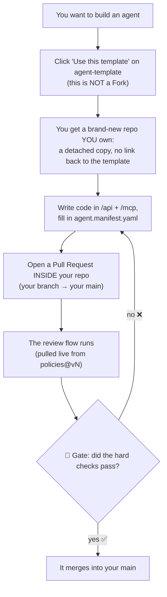

# agent-template — the starter kit

> **Part of 图灵星球 Agent 军团.** New here? Start at the overview: **https://github.com/turingplanet/agent-legion**

This is the **starter kit** you copy to begin a new agent. It holds the contract (`manifest.schema.json`), a manifest to fill in, and a thin pointer to the shared review flow. You copy it **once** ("Use this template"); after that your repo is independent.

## How to start your own agent

1. Click **"Use this template" → Create a new repository**. This is a detached copy you own — **not a Fork**.
2. In your new repo, write your code in `/api` + `/mcp` and fill in `agent.manifest.yaml`.
3. Open a pull request **inside your repo** (a branch → your `main`). That runs the review flow from [`policies@vN`](https://github.com/turingplanet/policies), and the gate decides whether it merges.

You never fork this repo or `policies`. You copy this kit **once**, and your workflow *references* `policies` by version. See the overview for the full picture of how the three repos fit together.
